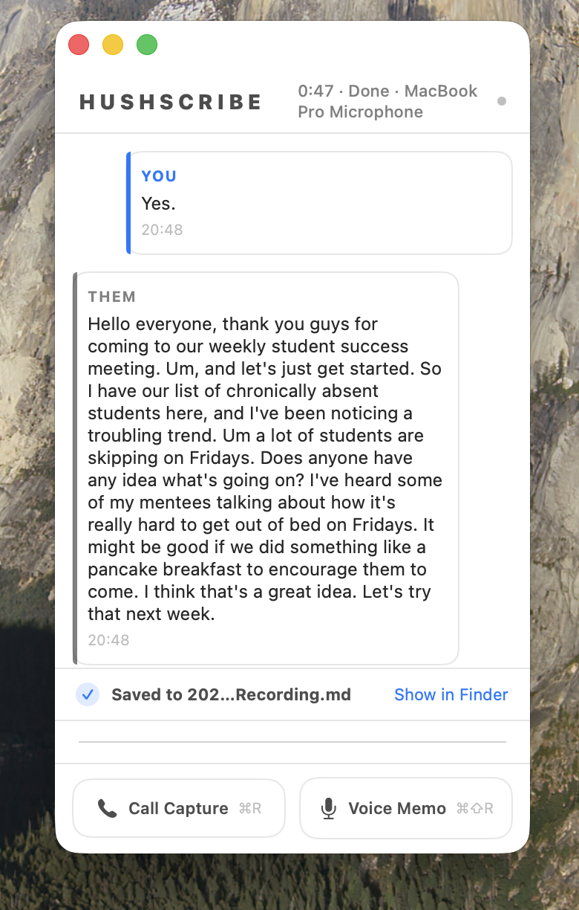

<h1 align="center">HushScribe</h1>

<p align="center">
  <strong>Local meeting transcription for macOS. No cloud. No API keys. Your data stays on your machine.</strong>
</p>

<p align="center">
  
  
  
  
</p>

---

> **HushScribe is a fork of [Tome](https://github.com/Gremble-io/Tome)**, substantially extended with additional features. See [Credits](#credits) for the original project. Most modifications are made using Claude Code.

## Overview

HushScribe is a macOS menu bar app that captures meetings and voice memos, transcribes them on-device, and writes structured `.md` files to a folder of your choice — including your Obsidian vault.

Every step runs locally. Transcription uses on-device models (Parakeet-TDT v3, WhisperKit, or Apple Speech). The AI summary is generated on-device via Apple's NaturalLanguage framework. No audio, no transcripts, and no data of any kind is ever sent to the internet.

<p align="center">
  
  
  
  
</p>

## Installing

**Via Homebrew (recommended):**

```bash
brew tap drcursor/hushscribe https://github.com/drcursor/HushScribe
brew install --cask hushscribe
```

**Manual:** Download the DMG from the [latest release](https://github.com/drcursor/HushScribe/releases/latest) and drag HushScribe to `/Applications`.

The current release is not code-signed. macOS will block it from opening by default. See the [Troubleshooting](#troubleshooting) section for steps to bypass Gatekeeper, or follow the instructions shown after installing via Homebrew.

## Why HushScribe?

- **Entirely local.** All transcription models run on Apple Silicon. The AI summary uses Apple's on-device NaturalLanguage framework. Nothing leaves your machine — ever.
- **Plain markdown output.** YAML frontmatter, tags, timestamps, speaker labels. Lands in your vault ready to process. No proprietary format, no export step.
- **Built for agent workflows.** HushScribe is the capture layer. It transcribes and writes the `.md`; your agent or automation picks it up and does the rest.
- **No accounts, no subscriptions.** No sign-up, no API keys, no cloud dependency.

```
speak → capture → vault → agent → knowledge base
```

## Features

- **Multilingual transcription** via Parakeet-TDT v3 ([FluidAudio](https://github.com/FluidInference/FluidAudio)) — 25 European languages, auto-detected, runs on Apple Silicon ANE.
- **Multiple transcription models.** Choose between Parakeet-TDT v3 (default, fastest), WhisperKit Base, WhisperKit Large v3, or Apple Speech (built-in, no download required). All run entirely on-device.
- **Call Capture** grabs mic + system audio. Detects which conferencing app you're in (Teams, Zoom, Slack, etc.) and filters audio to just that app.
- **Voice Memo** is mic-only. Saves to a separate folder so it doesn't clutter your meeting transcripts.
- **On-device AI summary.** Each transcript includes a Summary section with Topics, Highlights, and To-Dos, generated locally using Apple's NaturalLanguage framework — no API key, no network.
- **Speaker diarization** runs after the call ends. Splits remote audio into labelled speakers; post-session prompt lets you assign real names.
- **Split VU meters.** Separate level meters for microphone and system audio, each with an independent mute toggle.
- **Vault-native output.** Writes `.md` with frontmatter: `type`, `created`, `attendees`, `tags`, `source_app`.
- **Silence auto-stop.** Configurable timeout (default 2 min); countdown shown during recording.
- **Privacy mode.** Hidden from screen sharing by default. No audio saved to disk — transcripts only.

## Differences Compared to Tome

HushScribe diverges from [Tome](https://github.com/Gremble-io/Tome) in the following ways:

- **Menu bar app.** Lives in the menu bar with no dock icon by default. Main window is hidden on launch after the first run and shown via "Show HushScribe".
- **Multiple transcription models.** Adds WhisperKit Base, WhisperKit Large v3, and Apple Speech alongside Parakeet. All on-device.
- **On-device AI summary.** Topics, Highlights, and To-Dos appended to each transcript using Apple's NaturalLanguage framework.
- **Split VU meters.** Separate mic and system audio meters, each with a mute toggle.
- **Pause/resume recording.** Available from both the main UI and the menu bar.
- **Post-session speaker naming.** Prompts to assign real names to detected speakers after diarization. (Contributed by [0xLeathery](https://github.com/0xLeathery/Tome/tree/feature/speaker-naming).)
- **Silence timeout display and configuration.** Countdown shown below the waveform, configurable in Settings, resets on click.
- **80s-style segmented LED VU meter.** Blocky green/yellow/red LED-segment style.
- **Follows macOS system appearance.** Adapts to Light or Dark mode.
- **No auto-update system.** Sparkle removed; updates via GitHub releases.
- **Current input device display.** Active microphone shown next to the session timer.

## Planned Functionality

- Auto-detect meetings and start recording automatically
- Better model handling
- Bettery summarisation

## Output

<p align="center">
  
</p>

<p align="center">
  
</p>

```markdown
---
type: meeting
created: "2026-03-23"
time: "10:00"
duration: "18:42"
source_app: "Zoom"
attendees: ["You", "Speaker 2"]
tags:
  - log/meeting
  - status/inbox
  - source/hushscribe
---

# Call Recording — 2026-03-23 10:00

## Summary

**Topics**
- Product launch
- QA sign-off

**Highlights**
- QA signed off yesterday, marketing assets locked, landing page live in staging

**To-Dos**
- None identified.

---

## Transcript

**You** (10:00:03)
Morning. Quick sync on the product launch. Where are we at?

**Speaker 2** (10:00:07)
We're in good shape. QA signed off yesterday, marketing assets
are locked, landing page is live in staging.
```

Voice memos use `type: fleeting` with a single speaker. Same structure, same frontmatter.

## Build

See [ARCHITECTURE.md](ARCHITECTURE.md) for the full build instructions and project structure.

## Permissions

| Permission | When | Why |
|---|---|---|
| **Microphone** | All modes | Captures your voice |
| **Screen Recording** | Call Capture only | ScreenCaptureKit needs this for system audio from conferencing apps |
| **Speech Recognition** | Apple Speech model only | Required by SFSpeechRecognizer; one-time prompt |

macOS re-prompts for Screen Recording permission roughly monthly. That's an OS thing, not HushScribe.

## Architecture

See [ARCHITECTURE.md](ARCHITECTURE.md) for the full architecture overview and source tree.

## Privacy

- All transcription models run entirely on-device. No audio is ever sent anywhere.
- AI summaries are generated on-device using Apple's NaturalLanguage framework. No external API.
- No network calls. No analytics. No telemetry.
- No audio is saved to disk. Only text transcripts.
- The app window is hidden from screen sharing by default.
- Transcripts are saved as plain `.md` files to a folder you choose.

## Known Limitations

- **Apple Silicon only.** Parakeet and FluidAudio need Metal / ANE. No Intel.
- **macOS 26+ only.**
- **Screen Recording re-prompts monthly.** OS limitation.
- **Diarization is imperfect.** Works well with headset mics. Laptop speakers with crosstalk will give worse speaker separation.
- **No live speaker labels.** Diarization runs after the session ends.

## Troubleshooting

**"HushScribe is damaged and can't be opened"**

This is macOS Gatekeeper blocking an unsigned app. Until a signed release is available, run the following command on your terminal : `xattr -d com.apple.quarantine /Applications/HushScribe.app`

You only need to do this once — after that, HushScribe launches normally.

Alternatively, build from source (see [Build](#build) above) to avoid Gatekeeper entirely.

## Credits

HushScribe is a fork of [Tome](https://github.com/Gremble-io/Tome) by [Gremble-io](https://github.com/Gremble-io), which itself started from [OpenGranola](https://github.com/yazinsai/OpenGranola).

**Models and libraries:**

- [FluidAudio](https://github.com/FluidInference/FluidAudio) by FluidInference — Parakeet-TDT v3 ASR and Silero VAD, used for the default transcription model and voice activity detection across all backends.
- [WhisperKit](https://github.com/argmaxinc/WhisperKit) by Argmax — on-device Whisper inference on Apple Silicon, used for the Whisper Base and Whisper Large v3 model options. Whisper was originally developed by [OpenAI](https://github.com/openai/whisper).
- [pyannote.audio](https://github.com/pyannote/pyannote-audio) — speaker diarization model used for post-session speaker separation.

## Changelog

See [CHANGELOG.md](CHANGELOG.md) for the full release history.

## License

[MIT](LICENSE)
