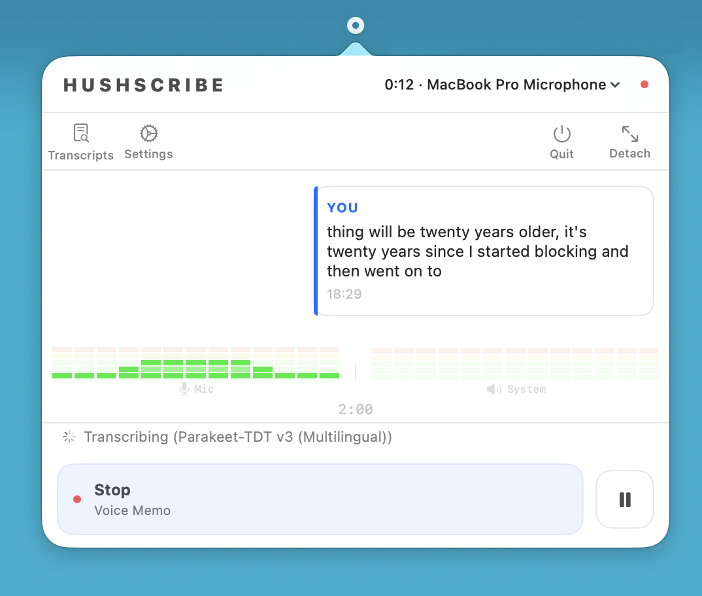
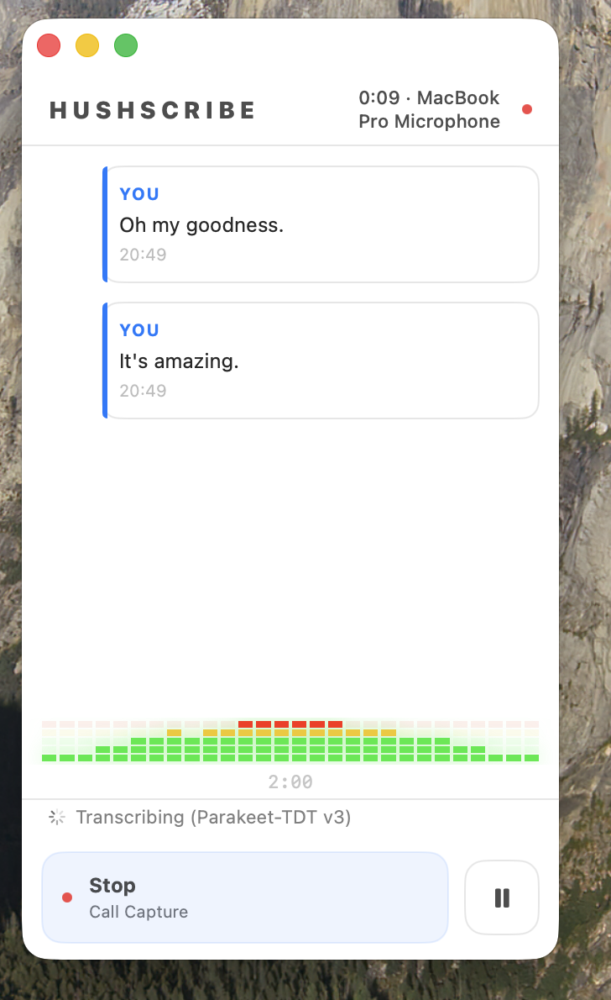
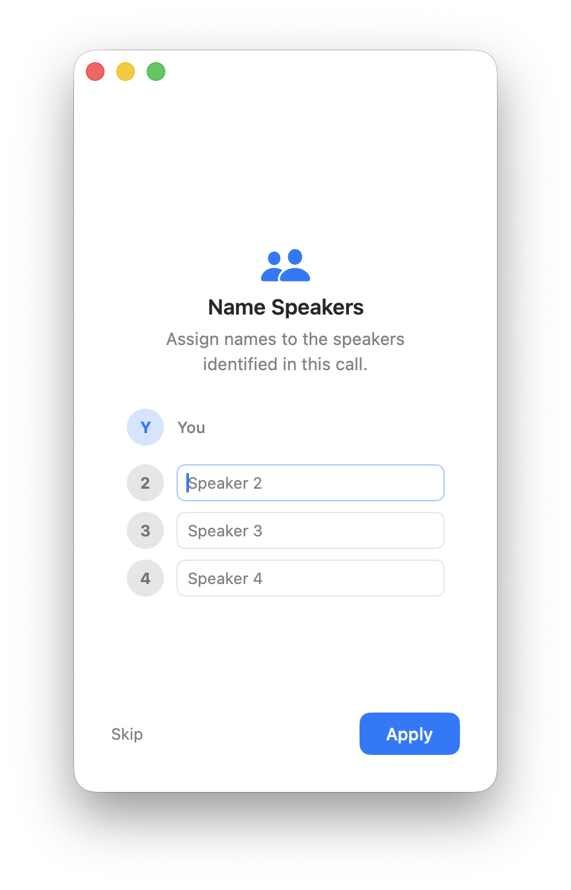

<h1 align="center">HushScribe</h1>

<p align="center">
  <strong>Local meeting transcription for macOS. No cloud. No API keys. Your data stays on your machine.</strong>
</p>

<p align="center">
  
  
  
  
</p>

---

## Overview

HushScribe is a macOS menu bar app that captures meetings and voice memos, transcribes them on-device, and writes structured `.md` files to a folder of your choice (eg. including your Obsidian vault).

Every step runs locally. Transcription uses on-device models (Parakeet-TDT v3, WhisperKit, or Apple Speech). The AI summary is generated on-device via Apple's NaturalLanguage framework. No audio, no transcripts, and no data of any kind is ever sent to the internet.

<p align="center">
  
  
  
</p>

## Installing

**Via Homebrew (recommended):**

```bash
brew tap drcursor/hushscribe https://github.com/drcursor/HushScribe
brew install --cask hushscribe
```

**Manual:** Download the DMG from the [latest release](https://github.com/drcursor/HushScribe/releases/latest) and drag HushScribe to `/Applications`.

## Why HushScribe?

- **Entirely local.** Transcription and AI summary both run on-device — Parakeet, WhisperKit, Apple Speech, and Apple's NaturalLanguage framework. Nothing ever leaves your machine.
- **Your data, your files.** Output is plain `.md` with YAML frontmatter, timestamps, and speaker labels. No proprietary export, no lock-in, no copy-paste.
- **No accounts, no subscriptions, no API keys, no additional background services** Download and run.

```
speak → capture → md transcription → knowledge base
```

## Features

- **Multilingual transcription** via Parakeet-TDT v3 ([FluidAudio](https://github.com/FluidInference/FluidAudio)) — 25 European languages, auto-detected, runs on Apple Silicon ANE.
- **Multiple transcription models.** Choose between Parakeet-TDT v3 (default, fastest), WhisperKit Base, WhisperKit Large v3, or Apple Speech (built-in, no download required). All run entirely on-device.
- **Auto-record meetings.** Enable from the menu bar — recording starts automatically when a meeting app (Zoom, Teams, Slack, FaceTime, Webex, Discord, Google Meet, Loom) is running and the microphone is actively in use. Stops automatically when the call ends; configurable stop delay in Settings. Note: browser-based meetings (e.g. Google Meet in a browser) are not detected.
- **Call Capture** grabs mic + system audio. Detects which conferencing app you're in (Teams, Zoom, Slack, etc.) and filters audio to just that app.
- **Voice Memo** is mic-only. Saves to a separate folder so it doesn't clutter your meeting transcripts.
- **On-device AI summary.** Each transcript includes a Summary section with Topics, Highlights, and To-Dos, generated locally using Apple's NaturalLanguage framework — no API key, no network. (Experimental)
- **Speaker diarization** runs after the call ends. Splits remote audio into labelled speakers; post-session prompt lets you assign real names.
- **Split VU meters.** Separate level meters for microphone and system audio, each with an independent mute toggle.
- **Obsidian Vault-native compatible.** Writes `.md` with frontmatter: `type`, `created`, `attendees`, `tags`, `source_app`.
- **Silence auto-stop.** Configurable timeout (default 2 min); countdown shown during recording.
- **Privacy mode.** Hidden from screen sharing by default. No audio saved to disk — transcripts only.

## Privacy

- All transcription models run entirely on-device. No audio is ever sent anywhere.
- AI summaries are generated on-device using Apple's NaturalLanguage framework. No external API. (Experimental)
- No network calls. No analytics. No telemetry.
- No audio is saved to disk. Only text transcripts.
- The app window is hidden from screen sharing by default.
- Transcripts are saved as plain `.md` files to a folder you choose.

## Known Limitations and Issues

- **Apple Silicon only.** Parakeet and FluidAudio need Metal / ANE. No Intel.
- **macOS 26+ only.**
- **Screen Recording re-prompts monthly.** OS limitation.
- **AI Summaries are not there yet.**
- **Diarization is imperfect.** Works well with headset mics. Laptop speakers with crosstalk will give worse speaker separation.
- **No live speaker labels.** Diarization runs after the session ends.
- **Microphone input may stop working.** If no audio is captured, switching to a specific input device in Settings → Recording (instead of "System Default") usually resolves it.
- **Local sound input sometimes fails.** System audio capture may silently stop capturing. Changing the input device and restarting the recording session fixes it.
- **Auto-record meetings detction only for Applications** Browser-based meetings (e.g. Google Meet in a browser) are not detected.

## Output

```markdown
---
type: meeting
created: "2026-03-23"
time: "10:00"
duration: "18:42"
source_app: "Zoom"
attendees: ["You", "Speaker 2"]
tags:
  - log/meeting
  - status/inbox
  - source/hushscribe
---

# Call Recording — 2026-03-23 10:00

## Transcript

**You** (10:00:03)
Morning. Quick sync on the product launch. Where are we at?

**John** (10:00:07)
We're in good shape. QA signed off yesterday, marketing assets
are locked, landing page is live in staging.
```

- Voice memos use `type: fleeting` with a single speaker. Same structure, same frontmatter.
- User can generate AI Summaries of the transcript (Experimental)

## Build

See [ARCHITECTURE.md](ARCHITECTURE.md) for the full build instructions and project structure.

## Permissions

| Permission | When | Why |
|---|---|---|
| **Microphone** | All modes | Captures your voice |
| **Screen Recording** | Call Capture only | ScreenCaptureKit needs this for system audio from conferencing apps |
| **Speech Recognition** | Apple Speech model only | Required by SFSpeechRecognizer; one-time prompt |

macOS re-prompts for Screen Recording permission roughly monthly. That's an OS thing, not HushScribe.

## Architecture

See [ARCHITECTURE.md](ARCHITECTURE.md) for the full architecture overview and source tree.


## Credits

**HushScribe is a fork of [Tome](https://github.com/Gremble-io/Tome)** by [Gremble-io](https://github.com/Gremble-io), which itself started from [OpenGranola](https://github.com/yazinsai/OpenGranola), substantially extended with additional features. Code is generated with help of Claude Code.

**Models and libraries:**

- [FluidAudio](https://github.com/FluidInference/FluidAudio) by FluidInference — Parakeet-TDT v3 ASR and Silero VAD, used for the default transcription model and voice activity detection across all backends.
- [WhisperKit](https://github.com/argmaxinc/WhisperKit) by Argmax — on-device Whisper inference on Apple Silicon, used for the Whisper Base and Whisper Large v3 model options. Whisper was originally developed by [OpenAI](https://github.com/openai/whisper).
- [pyannote.audio](https://github.com/pyannote/pyannote-audio) — speaker diarization model used for post-session speaker separation.

## Changelog

See [CHANGELOG.md](CHANGELOG.md) for the full release history.

## License

[MIT](LICENSE)
